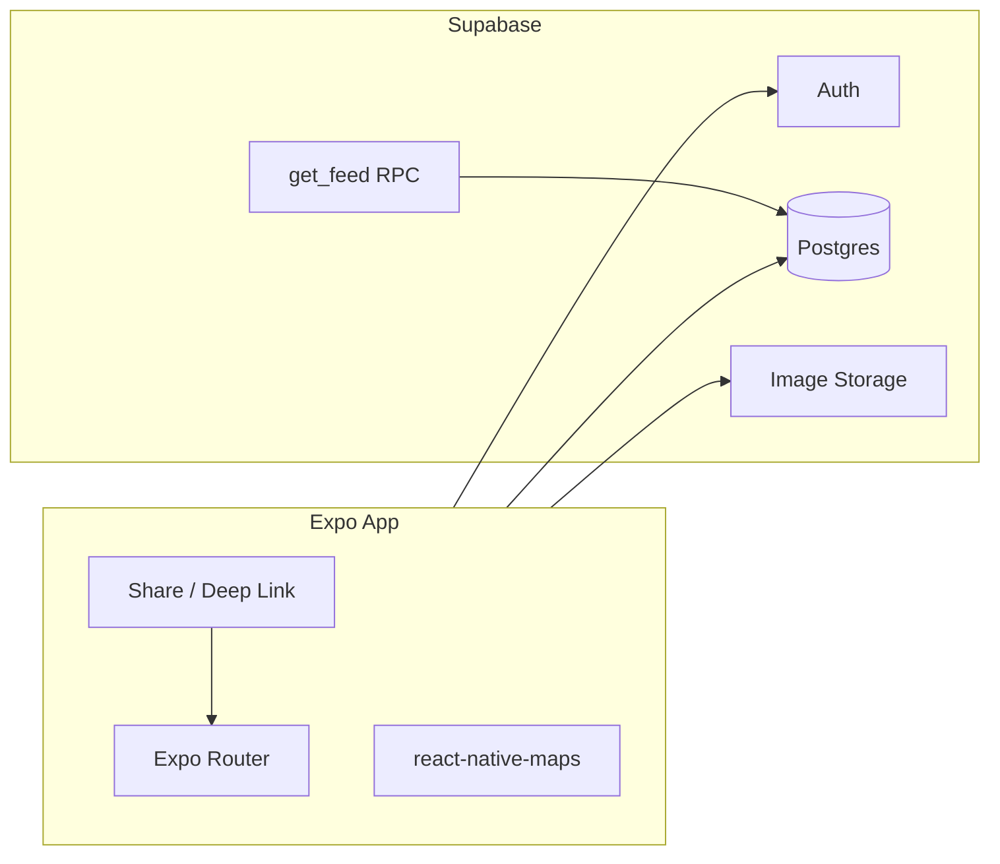

# Radar MVP

Delhi-only, **save-first**, **curated** restaurant discovery. V1 wins when recommendations feel personal and saving is effortless—not when the catalog is largest.

---

## North Star

| Principle        | Meaning |
|------------------|---------|
| Delhi only       | Single-city launch; map default ~28.6139, 77.2090 |
| Save-first       | Save in ≤2 taps from feed, map, or detail |
| Curated catalog  | 50–120 hand-tagged venues; quality over coverage |
| Rule-based recs  | Explainable scoring, not ML |

---

## Success Criteria (Measurable)

- User completes onboarding → sees a personalised feed in **< 60 seconds**
- User saves a restaurant from feed, map, or detail in **≤ 2 taps**
- User finds saved restaurants in profile
- **50+** curated restaurants with consistent tags across North / South / East / West Delhi
- Beta: 10–20 Delhi users on TestFlight / Play internal with 80–120 seeded venues by launch polish

---

## Tech Stack



| Layer | Choice | Notes |
|-------|--------|-------|
| Mobile | **Expo (SDK 52+)** + **Expo Router** | File-based routes; EAS Build for TestFlight / Play internal |
| Backend | **Supabase** | Auth, Postgres, RLS, Storage; optional Edge Functions |
| Maps | `react-native-maps` | Delhi bbox default; pins from DB |
| Client state | React Query + Supabase JS | Cache feed, saves, profile |
| Analytics (optional) | PostHog or Expo Insights | Onboarding complete, save, review |

**Repo layout (target):**

```
app/           # Expo Router screens
lib/           # supabase client, types, helpers
supabase/      # migrations, config
scripts/       # seed-restaurants.ts
data/          # restaurants.json seed
docs/          # product docs (this folder)
```

---

## Data Strategy

**Hybrid: curated seed first, API search later.**

| Approach | MVP role |
|----------|----------|
| Manual curated seed (50–120) | Primary catalog + recommendations |
| Google Places (optional, later) | Share-sheet / “find place” search only; never auto-import unreviewed POIs into feed |

**Seed workflow:** Spreadsheet / Airtable → `data/restaurants.json` → `scripts/seed-restaurants.ts` → Supabase.

Each row must include: name, cuisine, area, neighbourhood, price band (1–4), lat/lng, images, vibe + occasion + food tags, description. ~15 venues flagged `is_editors_pick` for cold start.

**Do not** scrape Instagram in MVP. Ship **search fallback** for share flow first.

---

## Data Model Summary

### Enums

- `delhi_area`: `north` | `south` | `east` | `west`
- `tag_type`: `vibe` | `occasion` | `food`
- `streak_event_type`: `save` | `review`

### Core tables

| Table | Purpose |
|-------|---------|
| `restaurants` | Catalog: name, slug, cuisine, price_band, area, neighbourhood, lat/lng, description, image_urls[], avg_rating, save_count, is_editors_pick |
| `restaurant_tags` | Many-to-many tags per restaurant (`tag_type` + `tag`) |
| `user_preferences` | cuisines[], budget_band, occasions[], vibes[], preferred_areas[] |
| `saves` | user_id + restaurant_id (unique) |
| `reviews` | rating + body (one per user per restaurant) |
| `streak_events` | Daily save or review events for streak count |
| `profiles` | Optional extension of auth.users |

### Key server functions

- `get_feed(user_id, lat, lng)` — rule-based score + `match_reason`
- `get_streak_count(user_id)` — consecutive days with events
- `search_restaurants(query)` — name / neighbourhood search (share screen)

### RLS (summary)

- Restaurants and tags: **read** by all authenticated users
- Saves, reviews, preferences, streak events: **write** own rows only

### Recommendation scoring (example)

```
score =
  + 3 × cuisine_match
  + 2 × budget_match
  + 2 × occasion_or_vibe_tag_overlap
  + 2 × preferred_area_match
  + 1 × proximity_decay (~8 km cap in Delhi)
  - 5 × already_saved
  + 0.5 × avg_rating
```

**Cold start:** editor’s picks + popular by recent saves when preferences are empty.

---

## MVP Scope — In vs Out

### In MVP (Delhi beta)

1. **Auth** — phone OTP or Apple / Google (sign-in before save)
2. **Onboarding** — cuisine, budget, occasion / vibe; stored in `user_preferences`
3. **Home feed** — `get_feed` ranked list
4. **Restaurant detail** — full card + save CTA + reviews list
5. **Map discovery** — pins, bottom sheet, search, filters (area, cuisine, tag)
6. **Save / bookmark** — profile tab lists saved spots
7. **Reviews** — 1–5 stars + short text
8. **Profile** — saved list, my reviews, streak display
9. **Light streak** — increment on save or review once per day; no leaderboards
10. **Instagram share (minimal)** — deep link / share target → **search catalog → save**

### Deferred (documented, not beta-blocking)

| Item | Notes |
|------|-------|
| Instagram caption / URL parsing | Search-only in MVP |
| Onboarding mascot animations | Light progress UI only |
| Streak push notifications | Display count only |
| Google Places catalog expansion | Optional search helper later |
| Swipe discovery | [ROADMAP.md](./ROADMAP.md) |
| Group voting | Post-V1 |
| Community layer | Post-V1 |
| Monetization | Post-V1 |

---

## App Structure (Expo Router)

```
app/
  (auth)/login.tsx
  (onboarding)/preferences.tsx
  (tabs)/
    index.tsx          # Home feed
    map.tsx            # Map + search
    profile.tsx        # Saved, reviews, streak
  restaurant/[id].tsx  # Detail
  share.tsx            # Deep link from share extension
```

**Tab bar:** Home | Map | Profile

---

## Phased Delivery (6–8 weeks, solo)

### Phase 0 — Foundation (week 1)

- Init Expo + Router + Supabase
- Auth, env templates, EAS profiles
- DB migrations + RLS
- Import first **30** restaurants from JSON seed

### Phase 1 — Core loop (weeks 2–3)

- Onboarding → preferences
- Restaurant detail + save
- Profile saved list
- Basic feed (prefs-based, pre-scoring)

### Phase 2 — Discovery (weeks 4–5)

- Map pins + bottom sheet
- Search + filters
- `get_feed` RPC
- Reviews on detail + profile

### Phase 3 — Polish & beta (weeks 6–8)

- Streak counter
- Expand seed to **80–120** restaurants
- Share deep link + search-to-save
- TestFlight + Delhi beta users
- Image sizing, feed pagination

---

## Launch Checklist (Non-code)

- [ ] Tag vocabulary applied consistently — [tags.md](./tags.md)
- [ ] Delhi-only copy and map center
- [ ] Privacy policy + terms (saves / reviews are PII)
- [ ] App Store screenshots: feed, map, save, profile

---

## Risks & Mitigations

| Risk | Mitigation |
|------|------------|
| Share extension complexity on iOS | Deep link + in-app search first |
| Thin catalog | Launch neighbourhood-by-neighbourhood with depth (e.g. Hauz Khas + GK) |
| Generic recommendations | Curated tags + explainable `match_reason` |
| Vision creep | Lock scope here; post-V1 in [ROADMAP.md](./ROADMAP.md) |

---

## Related Docs

- [PRODUCT_VISION.md](./PRODUCT_VISION.md)
- [tags.md](./tags.md)
- [ROADMAP.md](./ROADMAP.md)
