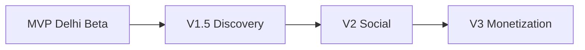

# Radar — Post-V1 Roadmap

Features and business directions **explicitly out of scope** for the Delhi MVP beta. Use this doc to park ideas without expanding V1.

**Principle:** Ship a focused save-first curator in Delhi before adding social surfaces or monetization.

---

## Timeline Overview

| Phase | Theme | Horizon (indicative) |
|-------|--------|----------------------|
| **V1** | Curated catalog, feed, map, save, reviews, light streak | Now — [MVP.md](./MVP.md) |
| **V1.5** | Smarter discovery, share intelligence | +2–4 months post-beta |
| **V2** | Social & collaborative eating | +6–12 months |
| **V3** | Experience-led monetization | When retention proven |

---

## 1. Swipe Discovery (V1.5)

**Tinder-style** restaurant discovery:

- Swipe right to save / left to skip
- Learn from swipe behaviour over time
- Refine rule-based or light ML ranking
- Optional “super save” or shortlist queue

**Depends on:** Stable V1 catalog, enough session data, clear save semantics from MVP.

**Not in MVP because:** Save-first feed and map already define core loop; swipe adds UX complexity before catalog depth is proven.

---

## 2. Group Voting (V2)

Collaborative **where should we eat** flows:

- Create groups and shared lists
- Vote on restaurants (yes / no / maybe)
- Decide as a group with deadline or live session
- Export shortlist to Maps or calendar

**Depends on:** Auth, profiles, reliable restaurant IDs, notification infra.

**Not in MVP because:** Requires social graph and real-time or async coordination—not needed to validate personal discovery.

---

## 3. Community Layer (V2)

Lightweight **food community** inside Radar:

- Ask for recommendations (“Best quiet date spot in South Delhi?”)
- Give recommendations tied to saved / reviewed places
- Discuss restaurants (threads or replies)
- Follow tastemakers or friends (optional)

**Design guardrails:**

- Curation over noise — not a generic forum
- Tie answers to structured restaurant cards
- Moderation and Delhi-only scope at first

**Not in MVP because:** Community needs critical mass; MVP validates personal taste and save behaviour first.

---

## 4. Monetization (V3)

Radar is **not** a discount-first platform. Long-term vision: **experience-led discovery** — exploration, curation, and access.

### 4.1 Digital loyalty / exploration systems

Examples:

- Coffee cards, cocktail / wine bar cards
- Partner venue exploration rewards
- “Visit 5 neighbourhoods” style city exploration

**Intent:** Encourage discovering more places across Delhi—not only rewarding spend.

### 4.2 Premium membership / access layer

Potential offerings:

- Exclusive restaurant experiences
- Concierge-style planning
- Bank / brand partnerships
- Curated community events
- Members-only access experiences

**Positioning:** Experience, access, and curation over coupons. Radar as **tastemaker and cultural guide**, not a transactional reservation marketplace.

**Not in MVP because:** Requires partner pipeline, legal/commercial terms, and proven user trust.

---

## V1.5 Enhancements (Between MVP and V2)

| Feature | Description |
|---------|-------------|
| Instagram intelligence | Caption / URL hints for share-to-save (still no heavy scraping) |
| Google Places search | Match external POIs to curated catalog only |
| Push notifications | Streak reminders, new picks in favourite areas |
| Explainable feed | Richer `match_reason` on cards |
| Neighbourhood launches | Expand catalog citywide with depth per cluster |
| Second city | Only after Delhi retention metrics hit threshold |

---

## Deferred from Vision (Tracked Here)

| Item | Target phase |
|------|----------------|
| Swipe discovery | V1.5 |
| Group voting | V2 |
| Community Q&A / social | V2 |
| Loyalty cards | V3 |
| Premium membership | V3 |
| Leaderboards / heavy gamification | Not planned — conflicts with brand |
| Discount / coupon marketplace | Out of vision |

---

## Success Gates Before Each Phase

| Gate | Swipe (V1.5) | Social (V2) | Monetization (V3) |
|------|----------------|---------------|-------------------|
| Weekly active savers | 500+ | 2k+ | 5k+ |
| Catalog depth | 200+ tagged venues | Same + UGC quality | Partner-ready venues |
| Retention | D7 > 25% | D30 > 15% | Willingness-to-pay signal |
| Ops | — | Moderation playbook | Legal + partnerships |

*Numbers are illustrative — set from beta learnings.*

---

## How to Propose a Feature

1. Check it is not already in [MVP.md](./MVP.md) **In MVP** list.
2. If post-V1, add a short note here with phase and dependencies.
3. Do not implement in app until phase is active and success gates are met.

---

## Related Docs

- [PRODUCT_VISION.md](./PRODUCT_VISION.md) — Full vision and brand philosophy
- [MVP.md](./MVP.md) — Current build scope
- [tags.md](./tags.md) — Catalog vocabulary
